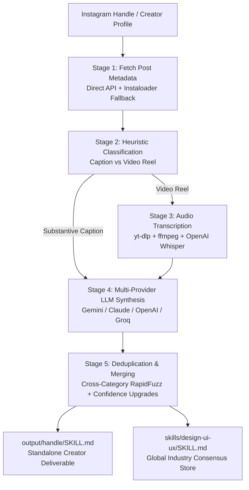

# Project Architecture & Workflow Guide

> A comprehensive technical overview of **IG Design-Skill Extractor**: how the end-to-end pipeline operates, the open-source technologies powering each stage, security constraints, and data flows.

---

## 1. System Overview & Objective

The **IG Design-Skill Extractor** is an automated pipeline that monitors top UI/UX design creators on Instagram, harvests their tutorial videos (reels) and text breakdowns, transcribes spoken advice using local AI models, and synthesizes these insights using Large Language Models (LLMs) into structured, actionable **Claude Skills** (`SKILL.md`).



---

## 2. Complete End-to-End Pipeline Stages

### Stage 1: Dual-Engine Metadata Harvesting (`scripts/fetch_posts.py`)
- **What it does**: Connects to Instagram using Netscape session cookies, fetches the most recent $N$ posts (captions, shortcodes, timestamps, view/like counts, video flags), and saves them to `posts.json`.
- **Dual-Engine Scraping**:
  - **Primary Engine**: High-speed direct Instagram endpoint (`/api/v1/feed/user/...`).
  - **Fallback Engine**: Automated fallback to `instaloader.Profile.from_username()` if the direct API encounters layout shifts or deprecations.
- **Safety & Rate Limiting**: Enforces a strict 2–5 second sleep between network calls to protect your Instagram account from rate-limit blocks.

---

### Stage 2: Post Classification (`scripts/classify_posts.py`)
- **What it does**: Evaluates every post to determine the most cost-effective, high-yield analysis path:
  1. **`caption`**: The post has a substantive text caption ($\ge 40$ words) containing core UI/UX keywords (`padding`, `typography`, `hierarchy`, `auto-layout`, `contrast`, etc.). No audio download or Whisper computation needed.
  2. **`audio`**: The post is a video reel with a short caption. It is flagged for Whisper audio extraction.
  3. **`skip`**: Promotional spam, personal lifestyle clips, memes, or sponsor tags.

---

### Stage 3: Audio Extraction & Speech-to-Text (`scripts/transcribe_audio.py`)
- **What it does**: Downloads only the audio stream of video reels, generates verbatim transcripts using local AI, and deletes scratch audio immediately.
- **Technologies Used**:
  - **`yt-dlp`**: Open-source media extraction CLI configured with `-x --audio-format mp3` to guarantee **no video file is ever downloaded or saved to disk**.
  - **`ffmpeg`**: System audio codec engine for stream conversion.
  - **`openai-whisper`** (or `faster-whisper`): OpenAI's open-source neural network Speech-to-Text model (`small` model by default) running locally.
- **Zero-Footprint Guarantee**: Temporary audio files written to `data/tmp_audio/` are deleted inside a `finally:` block immediately after transcription completes.

---

### Stage 4: Principle Synthesis via Multi-Provider LLM (`scripts/extract_principles.py`)
- **What it does**: Submits post text and Whisper transcripts to an LLM to distill specific, checkable UI/UX rules.
- **Multi-Provider Fallback Chain**:
  - Sequentially evaluates: **`Anthropic Claude`** $\longrightarrow$ **`OpenAI GPT-4o`** $\longrightarrow$ **`Groq Llama 3.3`** $\longrightarrow$ **`Google Gemini 3.5 Flash Lite`**.
  - If a provider encounters a 429 rate limit or network glitch, it automatically logs a warning and tries the next configured provider.
  - **Header-Only Authentication**: API keys are transmitted exclusively via HTTP headers (`X-goog-api-key`, `Authorization`), preventing token leaks in URL access logs.
- **Prompt Guardrails**:
  1. **Copyright Paraphrasing**: Never quotes captions/transcripts verbatim; rephrases into authoritative design guidelines.
  2. **Strict Actionability Test**: Rejects vague platitudes (e.g. *"make it clean"*, *"balance the layout"*); requires checkable constraints, ratios, pairings, or methods.
  3. **Evidence Fidelity**: Strictly prohibits inventing fictitious pixel numbers, opacities, or color codes unless explicitly stated in the source text.
  4. **No Fabrication**: Returns an empty array `[]` if no concrete design principle is taught.

---

### Stage 5: Deduplication, Consensus & Markdown Generation (`scripts/merge_skill.py`)
- **What it does**: Merges newly extracted principles into existing knowledge stores, eliminates duplicates, upgrades confidence scores, tags cross-creator consensus, and generates production-ready markdown deliverables.
- **Technologies Used**:
  - **`rapidfuzz`**: High-performance C++ Levenshtein and token sort similarity algorithms.
- **Deduplication Engine**:
  - **Same-Category Matching**: Compares Title and Rule text ($\ge 85\%$ threshold).
  - **Cross-Category Semantic Matching**: Compares core rule instructions across categories ($\ge 80\%$ threshold) to merge conceptual overlaps.
- **Dynamic Confidence Upgrades**:
  - Upgrades principle confidence (`high > medium > low`) when subsequent posts independently reaffirm an existing guideline with higher specificity.
- **Consensus Tagging**:
  - ⭐ **Industry Standard**: Principles verified independently across multiple creators.
  - 🎯 **Creator Pattern**: Principles specific to one creator's unique signature style.

---

## 3. Technology Stack Breakdown

| Layer | Tool / Library | Purpose & Open-Source Details |
|---|---|---|
| **Data Extraction** | `instaloader` (v4.11+) | Open-source Python package for querying Instagram GraphQL and REST endpoints. |
| **Media Pipeline** | `yt-dlp` (v2024.1+) | Active open-source fork of youtube-dl for audio stream extraction. |
| **Audio Processing** | `ffmpeg` | Industry-standard open-source multimedia transcoding framework. |
| **Speech Recognition** | `openai-whisper` | OpenAI's open-source multi-lingual transformer-based ASR model. |
| **LLM Reasoning** | `Google Gemini 3.5 Flash Lite` | High-speed, high-token-efficiency LLM for design rule synthesis. |
| **Fuzzy Matching** | `rapidfuzz` (v3.6+) | Ultra-fast C++ Python bindings for fuzzy string matching and Levenshtein distance. |
| **Config & Secrets** | `PyYAML` & `python-dotenv` | Declarative YAML configuration and environment variable isolation. |
| **CLI & Progress** | `tqdm` | Extensible progress bar for pipeline tracking across stages. |

---

## 4. Repository Data Layout

```
ig-design-skill-extractor/
├── output/                         # Dedicated per-creator deliverables
│   ├── <creator_handle>/
│   │   ├── SKILL.md                # Standalone Claude Skill for this creator
│   │   ├── SUMMARY.md              # Visual markdown report with metrics & links
│   │   ├── principles.json         # Structured JSON schema (Source of Truth)
│   │   └── posts.json              # Full metadata & Whisper audio transcripts
├── skills/
│   └── design-ui-ux/
│       ├── SKILL.md                # Global multi-creator aggregate skill
│       └── principles.json         # Global principles store
├── scripts/
│   ├── fetch_posts.py              # Stage 1: Dual-engine metadata fetcher
│   ├── classify_posts.py           # Stage 2: Caption vs Audio classifier
│   ├── transcribe_audio.py         # Stage 3: Whisper audio transcriber
│   ├── extract_principles.py       # Stage 4: Multi-provider LLM design synthesizer
│   ├── merge_skill.py              # Stage 5: Deduplicator & Markdown compiler
│   ├── run_pipeline.py             # Pipeline orchestrator
│   └── clean_secrets.py            # Cookie auditing & scrubbing tool
├── cookies/                        # Local cookies folder (Gitignored)
├── state/
│   └── processed.json              # Idempotency log of handled post IDs
├── config.yaml                     # Pipeline parameters & category lists
├── requirements.txt                # Python dependencies
├── ARCHITECTURE.md                 # Technical architecture guide
├── PROJECT_SPEC.md                 # Full pipeline specification
└── README.md                       # Quickstart and overview
```

---

## 5. Security & Legal Architecture

1. **Audio-Only Principle**: No full video files (`.mp4`) are ever downloaded. Temporary audio files (`.mp3`) are deleted inside `finally:` blocks immediately after transcription.
2. **External Cookie Isolation**: Session cookies are resolved from `~/.config/ig-skill-extractor/cookies.txt` or `IG_COOKIES_PATH` to keep all session secrets outside of the git working tree.
3. **Pure Paraphrasing**: To comply with copyright requirements, extracted rules are synthesized into Claude's own words rather than quoting verbatim from creators.
4. **Idempotent Execution**: `state/processed.json` prevents re-fetching or re-transcribing posts that have already been processed.
