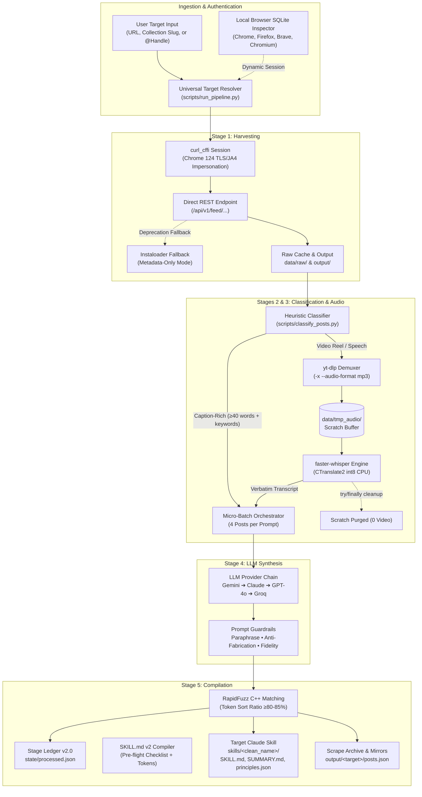

# Instagram Design-Skill Extractor — Technical Architecture

> Exhaustive technical specification and architecture guide: data ingestion mechanisms, audio pipeline internals, LLM synthesis constraints, deduplication mathematics, deliverable schema definitions, and security policies.

---

## Table of Contents

1. [High-Level Architectural Topology](#1-high-level-architectural-topology)
2. [Input Subsystem & Session Resolution](#2-input-subsystem--session-resolution)
3. [Stage-by-Stage Engineering Deep Dive](#3-stage-by-stage-engineering-deep-dive)
   - [Stage 1: Metadata Harvesting & Feed Pagination](#stage-1-metadata-harvesting--feed-pagination)
   - [Stage 2: Heuristic Content Classification](#stage-2-heuristic-content-classification)
   - [Stage 3: Audio Demuxing & Speech Recognition](#stage-3-audio-demuxing--speech-recognition)
   - [Stage 4: Micro-Batched LLM Distillation](#stage-4-micro-batched-llm-distillation)
   - [Stage 5: Fuzzy Deduplication & Skill Compilation](#stage-5-fuzzy-deduplication--skill-compilation)
4. [Data Structures & Schema Specifications](#4-data-structures--schema-specifications)
   - [Input Target Schema](#input-target-schema)
   - [Post Object Schema (`posts.json`)](#post-object-schema-postsjson)
   - [Principle Schema (`principles.json`)](#principle-schema-principlesjson)
   - [Stage Ledger Schema (`state/processed.json`)](#stage-ledger-schema-stateprocessedjson)
   - [Deliverable Schema (`SKILL.md` v2)](#deliverable-schema-skillmd-v2)
5. [Web Studio Architecture (FastAPI + Apple HIG)](#5-web-studio-architecture-fastapi--apple-hig)
6. [Security, Concurrency & Data Hygiene](#6-security-concurrency--data-hygiene)

---

## 1. High-Level Architectural Topology

The system is architected as an asynchronous, staged ETL pipeline with decoupled modules coordinated by a centralized orchestrator (`scripts/run_pipeline.py`) or triggered via a FastAPI Web Studio (`app.py`).


```mermaid
graph TD
    subgraph Ingestion ["Ingestion & Authentication"]
        InputTarget["User Target Input<br/>(URL, Collection Slug, or @Handle)"]
        BrowserDiscovery["Local Browser SQLite Inspector<br/>(Chrome, Firefox, Brave, Chromium)"]
        TargetResolver["Universal Target Resolver<br/>(scripts/run_pipeline.py)"]
        InputTarget --> TargetResolver
        BrowserDiscovery -.->|Dynamic Session| TargetResolver
    end

    subgraph Harvesting ["Stage 1: Harvesting"]
        TLSClient["curl_cffi Session<br/>(Chrome 124 TLS/JA4 Impersonation)"]
        DirectAPI["Direct REST Endpoint<br/>(/api/v1/feed/...)"]
        InstaloaderFallback["Instaloader Fallback<br/>(Metadata-Only Mode)"]
        TargetResolver --> TLSClient
        TLSClient --> DirectAPI
        DirectAPI -.->|Deprecation Fallback| InstaloaderFallback
        DirectAPI --> RawCache["Raw Cache & Output<br/>data/raw/ & output/"]
    end

    subgraph Analysis ["Stages 2 & 3: Classification & Audio"]
        Classifier["Heuristic Classifier<br/>(scripts/classify_posts.py)"]
        YTDLP["yt-dlp Demuxer<br/>(-x --audio-format mp3)"]
        WhisperSTT["faster-whisper Engine<br/>(CTranslate2 int8 CPU)"]
        ScratchStorage[("data/tmp_audio/<br/>Scratch Buffer")]
        
        RawCache --> Classifier
        Classifier -->|"Caption-Rich (≥40 words + keywords)"| Stage4
        Classifier -->|"Video Reel / Speech"| YTDLP
        YTDLP --> ScratchStorage
        ScratchStorage --> WhisperSTT
        WhisperSTT -->|"Verbatim Transcript"| Stage4
        WhisperSTT -.->|"try/finally cleanup"| Purge["Scratch Purged (0 Video)"]
    end

    subgraph Distillation ["Stage 4: LLM Synthesis"]
        Stage4["Micro-Batch Orchestrator<br/>(4 Posts per Prompt)"]
        LLMChain["LLM Provider Chain<br/>Gemini ➔ Claude ➔ GPT-4o ➔ Groq"]
        Guardrails["Prompt Guardrails<br/>Paraphrase • Anti-Fabrication • Fidelity"]
        Stage4 --> LLMChain
        LLMChain --> Guardrails
    end

    subgraph Assembly ["Stage 5: Compilation"]
        RapidFuzz["RapidFuzz C++ Matching<br/>(Token Sort Ratio ≥80-85%)"]
        Ledger["Stage Ledger v2.0<br/>state/processed.json"]
        SkillGen["SKILL.md v2 Compiler<br/>(Pre-flight Checklist + Tokens)"]
        
        Guardrails --> RapidFuzz
        RapidFuzz --> Ledger
        RapidFuzz --> TargetSkill["Target Claude Skill<br/>skills/&lt;clean_name&gt;/<br/>SKILL.md, SUMMARY.md, principles.json"]
        RapidFuzz --> TargetOutput["Scrape Archive & Mirrors<br/>output/&lt;target&gt;/posts.json"]
    end
```

---

## 2. Input Subsystem & Session Resolution

### Universal Target Resolution Algorithm
The resolver (`resolve_target()`) processes arbitrary string inputs into unambiguous target descriptors:

```python
def resolve_target(target: str, handle: str = None, collection: str = None) -> (handle, collection):
    # 1. Direct argument precedence
    if handle: return (handle.lstrip("@").strip(), None)
    if collection: return (None, collection.strip())

    # 2. Saved collection URL regex match
    # Format: https://www.instagram.com/<user>/saved/<name>/<id>/
    if "/saved/" in target or "/collection/" in target:
        return (None, target)

    # 3. Instagram profile URL pattern match
    # Format: https://www.instagram.com/<user>/
    match = re.search(r"instagram\.com/([a-zA-Z0-9._]+)/?", target)
    if match and match.group(1) not in ["p", "reel", "stories", "explore", "direct"]:
        return (match.group(1), None)

    # 4. Standard creator handle
    return (target.lstrip("@").strip(), None)
```

### Target Normalization & Skill Folder Naming Algorithm
To keep Claude skills organized cleanly, target inputs and directory names are normalized via `get_clean_skill_name()`:
```python
def get_clean_skill_name(target: str) -> str:
    """
    Normalizes target handle or collection identifier into clean folder slug.
    - 'collection_checkups' -> 'checkups'
    - '@zanderwhitehurst' -> 'zanderwhitehurst'
    - 'https://www.instagram.com/<user>/saved/checkups/123/' -> 'checkups'
    - 'designcode.io' -> 'designcode.io'
    """
    if not target:
        return "ui-ux"
    import re
    if "/saved/" in target:
        match = re.search(r"/saved/([^/?#]+)", target)
        if match:
            return match.group(1).lower().replace(" ", "-")
    clean = target.strip()
    if clean.startswith("collection_"):
        clean = clean[len("collection_"):]
    return clean.lstrip("@").strip().lower()
```

This guarantees that:
- A saved collection (e.g. `https://www.instagram.com/user/saved/checkups/1950348122301909/` or `checkups`) always produces `skills/checkups/`.
- A creator handle (e.g. `@zanderwhitehurst`) always produces `skills/zanderwhitehurst/`.
- Raw scraping records and transcripts remain archived under `output/<target>/`.
- **No global skill directory is created**; each skill folder represents an isolated, contextual design system.

### Zero-Extension Browser Cookie Auto-Detection
To eliminate friction with manual cookie exports, the pipeline inspects local browser profile databases in read-only copy mode:
1. **Firefox Profiles**: Queries `moz_cookies` for host `.instagram.com` (plaintext SQLite).
2. **Chromium-Based Browsers** (Chrome, Brave, Chromium): Reads cookies from `~/.config/*/Cookies` across native, Snap, and Flatpak installations.
3. **Session Decoupling**: If found, session tokens (`sessionid`, `ds_user_id`, `csrftoken`) are injected into the active session and cached locally in `cookies/instagram_cookies.txt` (gitignored).

---

## 3. Stage-by-Stage Engineering Deep Dive

### Stage 1: Metadata Harvesting & Feed Pagination
- **Fingerprint Impersonation**: Uses `curl_cffi` to mimic Chrome 124 TLS/JA4 signatures, preventing SSL fingerprint rejection.
- **Collection Pagination**:
  - Endpoint: `https://www.instagram.com/api/v1/feed/collection/{collection_id}/posts/`
  - Query parameters: `max_id` cursor pagination.
  - Pacing: 2.5–4.5 second random jitter between feed pages.
- **Creator Grid Pagination**:
  - Endpoint: `https://www.instagram.com/api/v1/feed/user/{user_id}/`
  - Fallback: `instaloader.Profile.from_username()` configured in strict metadata-only mode (`download_pictures=False`, `download_videos=False`).
- **Data Hygiene**: Stores raw response dictionaries in `data/raw/<target>/posts.json` and mirrored in `output/<target>/posts.json`. Never persists video files.

---

### Stage 2: Heuristic Content Classification
Content routing determines whether a post warrants audio transcription:
- **Rule 1 (`caption`)**: Caption length $\ge 40$ words AND matches at least one domain keyword from the design lexicon:
  ```
  padding, margin, typography, font, hierarchy, contrast, color, spacing,
  grid, layout, alignment, accessibility, wcag, figma, auto-layout, animation,
  motion, touch-target, skeleton, wireframe, micro-interaction
  ```
- **Rule 2 (`audio`)**: Video reel (`is_video == True`) with $< 40$ caption words.
- **Rule 3 (`skip`)**: Promotional posts, sponsor hashtags (`#ad`, `#sponsored`), lifestyle vlogs, or image carousels with insufficient text ($< 6$ words).

---

### Stage 3: Audio Demuxing & Speech Recognition
- **Stream Extraction**:
  Invokes `yt-dlp` with direct audio extraction flags:
  ```bash
  yt-dlp --extract-audio --audio-format mp3 --audio-quality 0 -o "data/tmp_audio/%(id)s.%(ext)s" <URL>
  ```
- **PyAV 14+ Compatibility Layer**:
  Modern PyAV versions deprecated and removed `metadata_errors` from `av.open()`, which breaks standard `faster-whisper` decoders. The transcription module monkey-patches `av.open()` at runtime to strip the unsupported parameter:
  ```python
  import av
  _orig_av_open = av.open
  def _patched_av_open(*args, **kwargs):
      kwargs.pop("metadata_errors", None)
      return _orig_av_open(*args, **kwargs)
  av.open = _patched_av_open
  ```
- **Inference Engine**:
  Executes `faster-whisper` using CTranslate2 with `compute_type="int8"` on CPU, achieving a 4× speedup over vanilla OpenAI Whisper with identical WER (Word Error Rate).
- **Strict Scratch Cleanup**:
  Scratch files in `data/tmp_audio/` are wrapped in `try/finally` blocks and deleted immediately upon transcript completion or on error.

---

### Stage 4: Micro-Batched LLM Distillation
- **Micro-Batching Architecture**:
  Instead of sequential 1-by-1 prompting with artificial delays, posts are chunked into micro-batches of 4:
  ```
  --- POST START ---
  Shortcode: Dd6TWQ0hpfH
  Author: @lincolndevine
  Content:
  <Spoken Transcript / Caption>
  --- POST END ---
  ```
- **Performance Impact**:
  - Individual prompting: 25 posts $\times$ (2s inference + 3s sleep) $\approx$ **125 seconds**.
  - Micro-batched prompting: 6 batches $\times$ 2.5s inference $\approx$ **15 seconds** (8× speedup).
- **Provider Cascade**:
  1. Google Gemini (`gemini-3.5-flash-lite`) — sub-second latency, zero token limits.
  2. Anthropic Claude (`claude-3-5-sonnet-20241022`).
  3. OpenAI (`gpt-4o-mini`).
  4. Groq (`llama-3.3-70b-versatile`).
- **Prompt Guardrails**:
  - *Copyright Paraphrasing*: Zero verbatim copying permitted; rules must be synthesized into original guidelines.
  - *Actionability Constraint*: Rejects platitudes ("keep it clean", "use good spacing"); requires checkable constraints, ratios, or values.
  - *Anti-Fabrication & Evidence Fidelity*: Prohibits inventing numbers or hex codes unless explicitly spoken by the creator.

---

### Stage 5: Fuzzy Deduplication & Skill Compilation
- **Levenshtein Token Sort Matching**:
  Uses `rapidfuzz.fuzz.token_sort_ratio` to compute similarity:
  $$\text{Similarity}(A, B) = \text{TokenSortRatio}(A, B)$$
  - *Same-Category Threshold*: $\ge 85\%$ match on principle name or rule text.
  - *Cross-Category Threshold*: $\ge 80\%$ match to catch conceptual redundancies across categories (e.g. `layout` vs `spacing`).
- **Confidence Elevation**:
  When a duplicate rule is reaffirmed, confidence is upgraded (`high > medium > low`), and the incoming source provenance is appended to `sources[]`.
- **Consensus Tagging**:
  - *Multi-Source Consensus*: Unique creators $\ge 2$.
  - *Creator Guideline*: Verified across 1 creator.
- **Target-Isolated Folder Deliverables (`skills/<clean_name>/`)**:
  - Compiles primary artifacts directly to `skills/<clean_name>/`:
    - `SKILL.md`: Claude Skill v2 deliverable with frontmatter, pre-flight checklist, design tokens, and structured rules.
    - `SUMMARY.md`: High-density visual audit report including post index, duration metrics, and classification distribution.
    - `principles.json`: Schema source of truth for programmatic queries.
  - Mirrors deliverables into `output/<target>/` alongside raw `posts.json` and Whisper audio transcripts.
  - **Zero Global Skill**: Each target is completely isolated. Running on collection `checkups` produces `skills/checkups/`; running on `@zanderwhitehurst` produces `skills/zanderwhitehurst/`. No monolithic global skill is maintained.

---

## 4. Data Structures & Schema Specifications

### Input Target Schema
Target strings passed via CLI `--target` or Web Studio API `/api/run`:
```typescript
type InputTarget = 
  | string // Instagram Profile URL: "https://www.instagram.com/zanderwhitehurst/"
  | string // Saved Collection URL: "https://www.instagram.com/user/saved/slug/id/"
  | string // Handle with @: "@designcode.io"
  | string // Plain Handle: "designcode.io"
  | string // Collection Slug: "design-tips"
```

### Post Object Schema (`posts.json`)
```typescript
interface PostRecord {
  post_id: string;               // Unique Instagram numeric ID (e.g. "3997592712018040775")
  shortcode: string;             // 11-char shortcode (e.g. "Dd6TWQ0hpfH")
  url: string;                   // Canonical Instagram URL
  date: string;                  // ISO Date (YYYY-MM-DD)
  caption: string;               // Raw caption text
  is_video: boolean;             // True if video reel / clip
  video_url: string | null;      // Temporary direct CDN stream URL
  video_duration?: number;       // Duration in seconds
  like_count: number;            // Engagement likes count
  owner_username?: string;       // Handle of author
  classification: {
    path: "caption" | "audio" | "skip";
    reason: string;
    word_count: number;
    matched_keywords: string[];
  };
  transcript?: string;           // Verbatim Whisper speech-to-text transcript
  principles?: PrincipleRecord[]; // Extracted principles
  extraction_metadata?: {
    method: "llm_batch" | "llm" | "error";
    provider?: string;
    model?: string;
    principles_count: number;
  };
}
```

### Principle Schema (`principles.json`)
```typescript
interface PrincipleRecord {
  principle: string;             // Imperative principle title (e.g. "Action-Oriented Modal Copywriting")
  category: "spacing" | "color" | "typography" | "hierarchy" | "motion" | "accessibility" | "layout";
  rule: string;                  // Concrete, checkable design constraint
  why: string;                   // Cognitive or ergonomic rationale
  example: string;               // UI component implementation pattern (often Before/After)
  confidence: "high" | "medium" | "low";
  sources: Array<{
    handle: string;              // Creator handle (without @)
    date: string;                // Date of cited post
    url: string;                 // URL to cited post
  }>;
}
```

### Stage Ledger Schema (`state/processed.json`)
```typescript
interface StateLedgerV2 {
  version: "2.0";
  posts: {
    [post_id: string]: {
      shortcode?: string;
      date?: string;
      is_video?: boolean;
      stages: {
        fetched: boolean;
        transcribed: boolean;
        extracted: boolean;
        completed: boolean;
      };
      principles_count?: number;
      last_updated: string;      // ISO 8601 Timestamp
    }
  }
}
```

### Deliverable Schema (`SKILL.md` v2)
The compiled markdown file follows this strict layout:
1. **YAML Frontmatter**: `name` and `description` triggering conditions.
2. **Document Title**: `# UI/UX Design System & Heuristics`.
3. **Pre-Flight UI/UX Audit Checklist**: 7 checklist items.
4. **Parametric Design Tokens**: Table of standard tokens (Base grid, padding, touch targets, radius, borders, typography).
5. **Categorized Principles**: Sections for active categories (`Color`, `Typography`, `Hierarchy`, `Motion`, `Accessibility`, `Layout`).
6. **Rule Items**:
   - `#### <Principle Title>`
   - `- **Rule**: <Specific Rule>`
   - `- **Rationale**: <Cognitive Rationale>`
   - `- **Implementation Pattern**: (with **Avoid** and **Do This** sub-bullets)`
   - `- **Consensus**: <Multi-Source Consensus | Creator Guideline>`
   - `- **Sources**: <Count> citation(s) — [@creator](url)`

---

## 5. Web Studio Architecture (FastAPI + Apple HIG)

The local Web Studio combines an asynchronous FastAPI server (`app.py`) with an Apple Human Interface Guidelines web frontend (`templates/index.html`):

### Architectural Characteristics:
- **Single-Page Application (SPA)**: Powered by Vue 3 (Composition API) and Tailwind CSS with true dark surfaces (`#141416`), SF Pro typography, and hairline borders (`rgba(255,255,255,0.08)`).
- **Server-Sent Events (SSE)**: Subprocess execution is streamed line-by-line via `/api/run/stream/{task_id}` into a macOS-style terminal console.
- **REST Endpoints**:
  - `GET /`: Serves the Apple HIG dashboard.
  - `GET /api/status`: Returns system diagnostics (browser session status, active LLM keys, extracted targets).
  - `GET /api/principles?target=<target>&category=<cat>`: Principle query API.
  - `GET /api/skill_md?target=<target>`: Raw deliverable markdown stream.
  - `POST /api/run`: Triggers the pipeline orchestrator asynchronously.
  - `POST /api/settings/keys`: Persists API keys to `.env` and runtime environment.

---

## 6. Security, Concurrency & Data Hygiene

| Constraint | Enforcement Mechanism |
|---|---|
| **Zero Video Persistence** | `yt-dlp` extracts audio streams directly (`-x`). Audio is written exclusively to `data/tmp_audio/` and unlinked in guaranteed `finally:` blocks. |
| **Secret Isolation** | Cookies are gitignored. Keys are read from `.env` and passed exclusively via HTTP headers (`X-goog-api-key`, `Authorization`), never in URLs or logged outputs. |
| **Anti-Automation Throttling** | Minimum 2–5 second delays between Instagram requests. Sequential execution for Instagram calls; parallelization is only applied to internal LLM micro-batches. |
| **Copyright Paraphrasing** | LLM system prompt strictly forbids verbatim quotations, synthesizing heuristics into original style-guide rules. |
| **Idempotency** | `state/processed.json` prevents duplicate network requests and redundant transcription for previously processed post IDs. |
