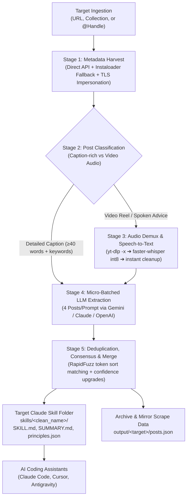

# Instagram Design-Skill Extractor

> Automated pipeline that harvests UI/UX design lessons from Instagram reels and carousels, transcribes spoken advice via local AI, synthesizes actionable heuristics via LLMs, and compiles production-ready **Claude Skills** (`SKILL.md`) for AI coding agents.

[](https://github.com/your-username/instagramScraper/actions)
[](https://www.python.org/)
[](LICENSE)
[](PROJECT_SPEC.md)

---

## Table of Contents

1. [Overview & Capabilities](#overview--capabilities)
2. [Input Formats & Ingestion](#input-formats--ingestion)
3. [Output Deliverable Structure](#output-deliverable-structure)
4. [Pipeline Architecture & Workflow](#pipeline-architecture--workflow)
5. [Quickstart & Installation](#quickstart--installation)
6. [Web Studio Dashboard](#web-studio-dashboard)
7. [Headless CLI Execution](#headless-cli-execution)
8. [Idempotency & State Tracking](#idempotency--state-tracking)
9. [Integration with AI Coding Agents](#integration-with-ai-coding-agents)
10. [Automated Testing & Data Hygiene](#automated-testing--data-hygiene)

---

## Overview & Capabilities

Top design engineers and creators on Instagram routinely publish high-density micro-lessons covering typography, spacing grids, visual hierarchy, kinetic motion, color theory, and accessibility. However, this advice is locked inside video reels and ephemeral posts.

**Instagram Design-Skill Extractor** unlocks this knowledge:
- **Universal Ingestion**: Scrapes public creator profiles or private saved bookmark collections using high-speed endpoints and zero-extension browser cookie auto-detection.
- **Zero Video Disk Footprint**: Demuxes audio streams directly using `yt-dlp` and `ffmpeg`. Verbatim speech is transcribed locally with `faster-whisper` (CTranslate2 int8 CPU quantization), and temporary audio files are purged immediately in guaranteed `finally:` blocks.
- **Transcript Micro-Batching**: Distills actionable principles by grouping posts into micro-batches of 4, slashing LLM extraction latency from ~8 minutes down to ~15 seconds without rate-limit pressure.
- **Strict Evidence Fidelity & Anti-Fabrication**: Prompt guardrails strictly prohibit inventing measurements, colors, or platitudes. Extracted heuristics are completely paraphrased into original language to respect copyright.
- **Semantic Deduplication**: Uses RapidFuzz token-sort similarity algorithms to merge duplicate rules across categories, combine multi-creator citations, and elevate confidence rankings.
- **SKILL.md v2 Specification**: Compiles a comprehensive style guide equipped with dynamic YAML frontmatter, a 7-point Pre-Flight UI/UX Audit Checklist, a Parametric Design Tokens Table, and structured `Do This` vs `Avoid` implementation patterns.

---

## Input Formats & Ingestion

The extractor features a **Universal Target Resolver** that automatically parses URLs, handles, and bookmark collections:

### 1. Supported Input Targets (`--target` or `-t`)

| Input Type | Example Input Format | Automatic Behavior |
|---|---|---|
| **Saved Collection URL** | `https://www.instagram.com/<user>/saved/checkups/1950348122301909/` | Resolves collection ID & slug, streams private collection feed via direct API. |
| **Collection Slug** | `checkups` or `design-tips` | Queries saved collection matching the slug. |
| **Profile URL** | `https://www.instagram.com/zanderwhitehurst/` | Extracts username handle and queries user feed. |
| **Creator Handle** | `@zanderwhitehurst` or `zanderwhitehurst` | Queries public creator feed. |

> *Note: Legacy flags `--handle <name>` and `--collection <url/slug>` remain fully supported for backward compatibility.*

### 2. Session Cookies & Authentication

Instagram requires session credentials to access saved collections or avoid aggressive guest rate limiting:

1. **Zero-Extension Browser Auto-Sync (Recommended)**:
   If you are logged into Instagram in your default browser (Google Chrome, Firefox, Brave, or Chromium), the extractor automatically discovers and imports your active session at runtime on Linux/macOS. No extensions, manual copying, or password entries needed.
2. **Netscape Cookie File**:
   Place an exported cookie file at `cookies/instagram_cookies.txt` or configure `IG_COOKIES_PATH=/path/to/cookies.txt`.
3. **External Config Directory**:
   Stores cookies outside the repository at `~/.config/ig-skill-extractor/cookies.txt`.

### 3. LLM API Keys (`.env`)

Set up one or more provider keys in your local `.env` file:
```bash
# Google Gemini (Default & Recommended - fast, free tier, zero latency)
GEMINI_API_KEY=your_gemini_api_key

# Optional Fallback Providers
GROQ_API_KEY=your_groq_api_key
OPENAI_API_KEY=your_openai_api_key
ANTHROPIC_API_KEY=your_anthropic_api_key
```

---

## Output Deliverable Structure

For every extraction run, the pipeline generates a dedicated Claude Skill directory directly inside `skills/<clean_name>/` alongside the full scraping archive in `output/<target>/`. There is **no global skill directory**; each collection or creator has its own self-contained, clean skill folder:

```
instagramScraper/
├── skills/                                     # Target-isolated Claude Skills (Zero global skills)
│   ├── <clean_name>/                           # e.g., checkups or zanderwhitehurst
│   │   ├── SKILL.md                            # Target Claude Skill v2 deliverable
│   │   ├── SUMMARY.md                          # Visual report with metrics & post index
│   │   └── principles.json                     # Structured JSON schema backing store
├── output/                                     # Raw scraping archive & mirrors
│   └── <target>/                               # e.g., collection_checkups or zanderwhitehurst
│       ├── posts.json                          # Full metadata, captions & Whisper audio transcripts
│       ├── SKILL.md                            # Mirror copy of target skill
│       ├── SUMMARY.md                          # Mirror copy of visual report
│       └── principles.json                     # Mirror copy of principles store
├── state/
│   └── processed.json                          # Stage-aware state ledger (Schema v2.0)
└── logs/
    └── run_<timestamp>.log                     # Complete forensic pipeline logs
```

### Clean Skill Folder Naming Rule

| Input Target Type | Input Value | Target Skill Directory | Scraping Archive Directory |
|---|---|---|---|
| **Saved Collection URL** | `https://www.instagram.com/<user>/saved/checkups/1950348122301909/` | `skills/checkups/` | `output/collection_checkups/` |
| **Collection Slug** | `checkups` | `skills/checkups/` | `output/collection_checkups/` |
| **Creator Handle** | `@zanderwhitehurst` or `zanderwhitehurst` | `skills/zanderwhitehurst/` | `output/zanderwhitehurst/` |
| **Profile URL** | `https://www.instagram.com/zanderwhitehurst/` | `skills/zanderwhitehurst/` | `output/zanderwhitehurst/` |

### Detailed Deliverable Specifications

#### 1. Target-Specific `SKILL.md` (Version 2.0)
Formulated specifically for ingestion by Claude Code, Cursor, and agentic LLMs:
- **YAML Frontmatter**: Injects triggering context into agent system prompts (`name: <clean_name>`, `description: "..."`).
- **Pre-Flight UI/UX Audit Checklist**: A 7-point checklist covering 8-pt spatial grids, whitespace separation over heavy border dividers, single left-aligned scanning anchors, above-the-fold verb-noun primary CTAs, touch targets (44×44pt minimum), and skeleton loading perception.
- **Parametric Design Tokens Table**: Standardized reference metrics for base spacing (`8px`), padding (`16px`/`24px`), border radii (`4px`, `8px`, `16px`, `9999px`), hairline borders (`1px solid rgba(255,255,255,0.08)`), and line-height balanced typography scales.
- **Domain Categories**: Organized into `Color`, `Typography`, `Hierarchy`, `Motion`, `Accessibility`, and `Layout`.
- **Implementation Patterns**: Concrete before/after architectural contrasts:
  ```markdown
  #### Action-Oriented Modal Copywriting
  - **Rule**: Replace vague interrogative titles with a direct verb-noun pairing.
  - **Rationale**: Explicit verb-noun headings eliminate ambiguity about irreversible actions.
  - **Implementation Pattern**:
    - **Avoid**: Modal title 'Are you sure?' with generic 'Yes' and 'No' buttons.
    - **Do This**: Modal title 'Delete Folder' with explicit 'Delete' (solid destructive) and 'Cancel' (ghost) buttons.
  - **Consensus**: Creator Guideline (Verified across 1 post(s) by @zanderwhitehurst)
  - **Sources**: 1 citation(s) (latest: 2024-09-23) — [@zanderwhitehurst](https://www.instagram.com/p/DAQf2QEAT7Z/)
  ```

#### 2. Structured `principles.json` Schema
```json
[
  {
    "principle": "Left-Aligned Typography for Single Alignment Anchors",
    "category": "layout",
    "rule": "Left-align multi-line blocks of text and UI elements to establish a single vertical alignment anchor.",
    "why": "Center-aligned text creates shifting horizontal anchors, increasing cognitive load and reading fatigue.",
    "example": "Align card title, body description, and price tags to a single left margin instead of centering.",
    "confidence": "high",
    "sources": [
      {
        "handle": "zanderwhitehurst",
        "date": "2026-08-19",
        "url": "https://www.instagram.com/p/DcN2nJEu9L2/"
      }
    ]
  }
]
```

#### 3. State Ledger `state/processed.json` (Schema v2.0)
Tracks granular per-post lifecycle stages to allow instant, intelligent resumption:
```json
{
  "version": "2.0",
  "posts": {
    "3997592712018040775": {
      "shortcode": "Dd6TWQ0hpfH",
      "date": "2026-09-30",
      "is_video": true,
      "stages": {
        "fetched": true,
        "transcribed": true,
        "extracted": true,
        "completed": true
      },
      "principles_count": 2,
      "last_updated": "2026-10-02T03:25:00.123456"
    }
  }
}
```

---

## Pipeline Architecture & Workflow



### Pipeline Execution Stages

1. **Stage 1: Fetch Metadata (`scripts/fetch_posts.py`)**  
   Harvests post metadata, captions, shortcodes, and stream URLs using direct REST endpoints (`/api/v1/feed/collection/{id}/posts/` or `/api/v1/feed/user/{id}/`) with Chrome 124 TLS/JA4 fingerprint impersonation (`curl_cffi`). Fallback to `instaloader` if private layout shifts occur.
2. **Stage 2: Classify Posts (`scripts/classify_posts.py`)**  
   Evaluates caption word count and design keyword density (`padding`, `typography`, `hierarchy`, `contrast`, `token`, `grid`). Dispatches caption-rich posts directly to extraction and reels to audio transcription.
3. **Stage 3: Transcribe Audio (`scripts/transcribe_audio.py`)**  
   Demuxes audio streams with `yt-dlp -x --audio-format mp3` into temporary scratch files. Transcribes spoken advice using `faster-whisper` (`compute_type="int8"`, patched for PyAV 14+). Guaranteed scratch cleanup inside `try/finally` blocks ensures zero videos or audio persist on disk.
4. **Stage 4: Extract Principles (`scripts/extract_principles.py`)**  
   Bundles posts into micro-batches of 4 and invokes the active LLM. Evaluates Gemini 3.5 Flash Lite $\rightarrow$ Claude 3.5 $\rightarrow$ GPT-4o $\rightarrow$ Groq. Enforces strict paraphrasing, anti-fabrication, and evidence-fidelity constraints.
5. **Stage 5: Deduplicate & Merge (`scripts/merge_skill.py`)**  
   Executes C++ token-sort fuzzy matching ($\ge 85\%$ same-category, $\ge 80\%$ cross-category). Combines creator citations, upgrades confidence scores, and compiles isolated target deliverables in `skills/<clean_name>/` (`SKILL.md` v2 spec, `SUMMARY.md`, `principles.json`) while archiving raw metadata into `output/<target>/`. Zero global skill files are generated.

---

## Quickstart & Installation

### 1. Prerequisites
- Python 3.10+
- `ffmpeg` installed on your system PATH:
  - macOS: `brew install ffmpeg`
  - Linux: `sudo apt install ffmpeg`
  - Windows: `winget install Gyan.FFmpeg`

### 2. Install Python Dependencies
```bash
git clone https://github.com/your-username/instagramScraper.git
cd instagramScraper

pip install -r requirements.txt
```

### 3. Configure API Keys
Create a `.env` file in the project root:
```bash
GEMINI_API_KEY=your_gemini_api_key
```

---

## Web Studio Dashboard

Launch the interactive local Web Studio:
```bash
python3 app.py
```
Open **[http://localhost:8080](http://localhost:8080)** in your browser.

- **Apple Human Interface Guidelines**: Refined dark surface (`#141416`), SF Pro typography, hairline borders (`rgba(255,255,255,0.08)`), and segmented tabs.
- **Universal Target Bar**: Paste an Instagram profile URL, `@handle`, or saved collection link.
- **Live Terminal Console**: Streams execution progress in real time via Server-Sent Events (SSE) with genuine macOS traffic light controls.
- **Searchable Principles Explorer**: Filter extracted principles by category (`Typography`, `Layout`, `Color`, `Motion`, `Accessibility`), search by keyword, and inspect citations.
- **One-Click Deliverable Export**: Preview and copy `SKILL.md` directly into Claude.

---

## Headless CLI Execution

The orchestrator CLI (`scripts/run_pipeline.py`) accepts unified targets and custom options:

### Process a Saved Bookmark Collection
```bash
python3 scripts/run_pipeline.py --target "https://www.instagram.com/sathyabalan6/saved/checkups/1950348122301909/" --limit 25
```

### Process a Creator Handle
```bash
python3 scripts/run_pipeline.py --target "@zanderwhitehurst" --limit 30
```

### Fast Caption-Only Run (Skip Whisper)
```bash
python3 scripts/run_pipeline.py --target "designcode.io" --limit 50 --skip-transcribe
```

### CLI Options Reference
- `--target, -t`: Target handle, profile URL, or collection URL (smart auto-detection).
- `--limit`: Maximum posts to fetch and process (default: `50`).
- `--skip-transcribe`: Skip audio download and Whisper speech-to-text.
- `--verbose, -v`: Enable verbose debug logging in terminal and log files.
- `--config`: Custom configuration path (default: `config.yaml`).

---

## Idempotency & State Tracking

The pipeline is 100% idempotent:
- **`state/processed.json`** records every post ID alongside its stage flags (`fetched`, `transcribed`, `extracted`, `completed`).
- Re-running the pipeline against an existing target will instantly skip already-processed posts and only harvest new content.
- If a run is interrupted during transcription or extraction, resuming the run re-uses cached metadata without re-querying Instagram endpoints.

---

## Integration with AI Coding Agents

Once a target skill is generated (e.g. `skills/checkups/` or `skills/zanderwhitehurst/`), integrate it into your AI coding workflows:

### 1. Claude Code CLI
```bash
claude "Load skills/checkups/SKILL.md and review our dashboard UI for 8-pt grid alignment, CTA hierarchy, and contrast."
```

### 2. Claude Desktop / Projects
Add `skills/<clean_name>/SKILL.md` (e.g. `skills/checkups/SKILL.md`) to Project Knowledge. Claude will cite the specific creator or collection heuristics when proposing frontend layouts.

### 3. Cursor & Antigravity
Reference or copy the target skill deliverable into your project's `.cursorrules` or skill folder:
```bash
cp skills/checkups/SKILL.md .cursor/rules/ui-ux-design.md
```

---

## Automated Testing & Data Hygiene

The project enforces strict safety guarantees validated by an automated test suite:
- **Zero Video Persistence**: Proves no `.mp4` files are saved to disk, and `data/tmp_audio/` is empty after execution.
- **Rule Paraphrasing**: Confirms no verbatim text leaks into rules.
- **Deduplication Logic**: Validates token-sort matching and confidence upgrades.
- **Universal Target Resolver**: Tests auto-detection of collections, profile URLs, and handles.
- **Stage Ledger Schema**: Validates version 2.0 migration and persistence.
- **Target Folder Isolation**: Verifies target skill folders under `skills/<clean_name>/` with no global skill created.

Run the test suite:
```bash
pytest tests/ -v
```

```
============================== 13 passed in 0.26s ==============================
```
